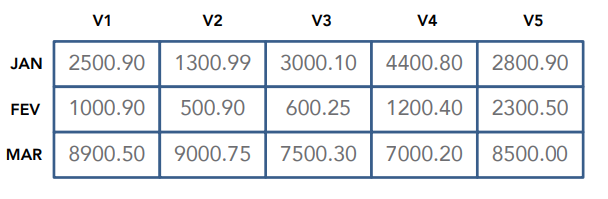

#vectors-and-matrices

Create a program that stores the matrices below, which represents the total of sales of 5 salespeople in the first quarter of 2012.

Then create functions for:
	(a) Show the salesman (1, 2, 3, 4 or 5) that sold the most in the firs quarter, as well with the sold value.
	(b) Show the month with the lowest sales and the value sold
